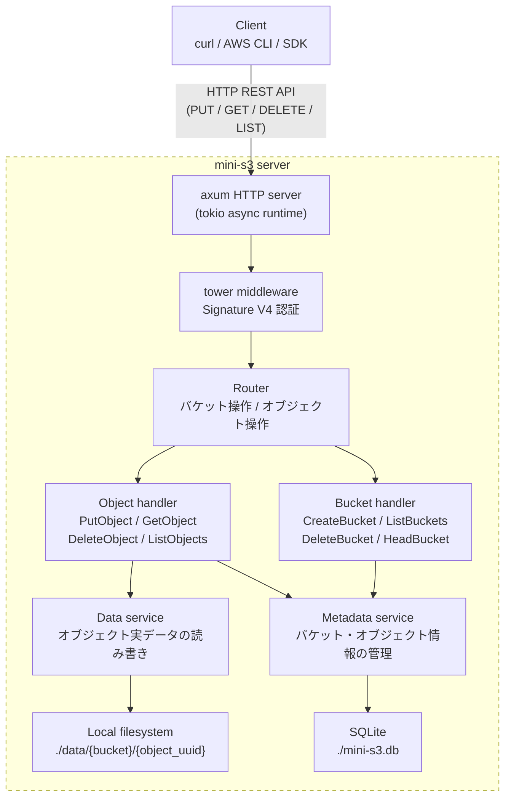
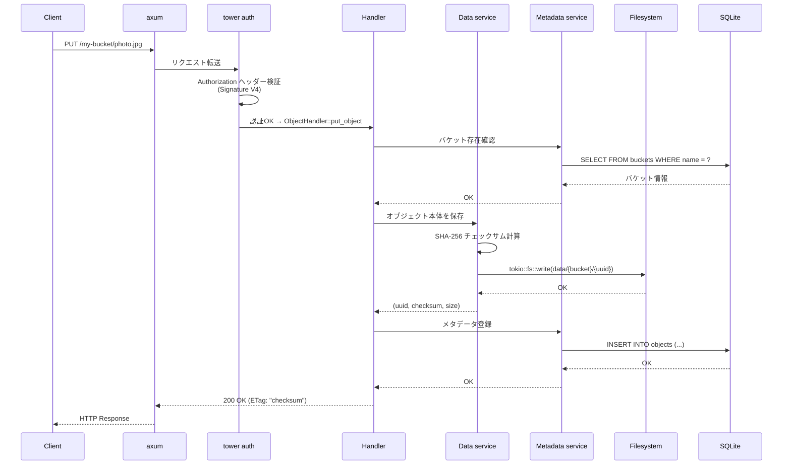
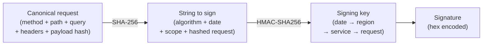

# ARCH-001: mini-s3 アーキテクチャ設計書

## 概要

S3 互換のオブジェクトストレージサービスを Rust でスクラッチ実装する。
AWS S3 の核心的な仕組み（バケット管理、オブジェクト CRUD、メタデータ管理、認証）を再現し、
クラウドストレージの内部動作を深く理解することを目的とする。

## 設計目的

- S3 REST API のコアサブセット（PUT / GET / DELETE / LIST）を実装する
- オブジェクトデータとメタデータを分離して管理する
- AccessKey / SecretKey による署名認証を実装する
- 非同期 I/O による高スループットなファイル読み書きを実現する

## 技術スタック

| カテゴリ         | 技術                | 用途                      |
| ---------------- | ------------------- | ------------------------- |
| 言語             | Rust (2024 edition) | 全体                      |
| HTTP サーバー    | axum                | REST API ルーティング     |
| async ランタイム | tokio               | 非同期 I/O 基盤           |
| ミドルウェア     | tower               | 認証・ログ・CORS          |
| DB               | SQLite + sqlx       | メタデータ永続化          |
| シリアライズ     | serde / serde_json  | リクエスト/レスポンス変換 |
| ID 生成          | uuid (v4)           | オブジェクト ID           |
| チェックサム     | sha2                | データ整合性検証 (ETag)   |
| XML 出力         | quick-xml           | S3 API レスポンス (XML)   |
| 日時             | chrono              | タイムスタンプ管理        |

## システムアーキテクチャ

### 全体構成図



### リクエスト処理フロー



## データモデル

docs/er.md を参考

## ディレクトリ構成

docs/directory-structure.md を参考

## API 仕様

### バケット操作

#### PUT /{bucket} — CreateBucket

バケットを新規作成する。

**リクエスト**:

```
PUT /my-bucket HTTP/1.1
Host: localhost:3000
Authorization: AWS4-HMAC-SHA256 ...
```

**レスポンス（成功: 200）**:

```
HTTP/1.1 200 OK
Location: /my-bucket
```

**レスポンス（エラー: 409）**:

```xml
<?xml version="1.0" encoding="UTF-8"?>
<Error>
  <Code>BucketAlreadyExists</Code>
  <Message>The requested bucket name is not available.</Message>
  <BucketName>my-bucket</BucketName>
</Error>
```

#### GET / — ListBuckets

所有する全バケットを一覧取得する。

**レスポンス（成功: 200）**:

```xml
<?xml version="1.0" encoding="UTF-8"?>
<ListAllMyBucketsResult>
  <Owner>
    <ID>access-key-id</ID>
    <DisplayName>account-name</DisplayName>
  </Owner>
  <Buckets>
    <Bucket>
      <Name>my-bucket</Name>
      <CreationDate>2026-03-28T10:00:00.000Z</CreationDate>
    </Bucket>
  </Buckets>
</ListAllMyBucketsResult>
```

#### DELETE /{bucket} — DeleteBucket

空のバケットを削除する。オブジェクトが残っている場合は 409 エラー。

#### HEAD /{bucket} — HeadBucket

バケットの存在確認。200 or 404 を返す。

### オブジェクト操作

#### PUT /{bucket}/{key} — PutObject

オブジェクトをアップロードする。

**リクエスト**:

```
PUT /my-bucket/photos/cat.jpg HTTP/1.1
Host: localhost:3000
Content-Type: image/jpeg
Content-Length: 12345
Authorization: AWS4-HMAC-SHA256 ...

<binary data>
```

**処理フロー**:

1. Authorization ヘッダーから Signature V4 を検証
2. バケットの存在と所有権を確認
3. リクエストボディを読み取り、SHA-256 チェックサムを計算
4. `data/{bucket_name}/{uuid}` にファイルを書き込み
5. メタデータを SQLite に INSERT（既存キーがあれば UPDATE）
6. ETag（チェックサム）をレスポンスヘッダーに含めて返却

**レスポンス（成功: 200）**:

```
HTTP/1.1 200 OK
ETag: "a1b2c3d4e5f6..."
```

#### GET /{bucket}/{key} — GetObject

オブジェクトをダウンロードする。

**レスポンス（成功: 200）**:

```
HTTP/1.1 200 OK
Content-Type: image/jpeg
Content-Length: 12345
ETag: "a1b2c3d4e5f6..."
Last-Modified: Sat, 28 Mar 2026 10:00:00 GMT

<binary data>
```

#### DELETE /{bucket}/{key} — DeleteObject

オブジェクトを削除する。メタデータ削除 → ファイル削除の順。

**レスポンス（成功: 204）**:

```
HTTP/1.1 204 No Content
```

#### GET /{bucket}?list-type=2 — ListObjectsV2

バケット内のオブジェクトを一覧取得する。

**クエリパラメータ**:

| パラメータ         | 型     | 必須 | 説明                             |
| ------------------ | ------ | ---- | -------------------------------- |
| list-type          | int    | ○    | 固定値: 2                        |
| prefix             | string | -    | キーのプレフィックスフィルタ     |
| delimiter          | string | -    | 階層区切り文字（通常 "/"）       |
| max-keys           | int    | -    | 最大取得件数（デフォルト: 1000） |
| continuation-token | string | -    | ページネーショントークン         |

**レスポンス（成功: 200）**:

```xml
<?xml version="1.0" encoding="UTF-8"?>
<ListBucketResult>
  <Name>my-bucket</Name>
  <Prefix>photos/</Prefix>
  <KeyCount>2</KeyCount>
  <MaxKeys>1000</MaxKeys>
  <IsTruncated>false</IsTruncated>
  <Contents>
    <Key>photos/cat.jpg</Key>
    <LastModified>2026-03-28T10:00:00.000Z</LastModified>
    <ETag>"a1b2c3d4e5f6..."</ETag>
    <Size>12345</Size>
  </Contents>
  <Contents>
    <Key>photos/dog.jpg</Key>
    <LastModified>2026-03-28T11:00:00.000Z</LastModified>
    <ETag>"f6e5d4c3b2a1..."</ETag>
    <Size>67890</Size>
  </Contents>
</ListBucketResult>
```

## 認証仕様

### AWS Signature V4（簡易版）

S3 API は Signature V4 による認証を行う。本プロジェクトでは以下の簡易版を実装する。

**Authorization ヘッダー形式**:

```
AWS4-HMAC-SHA256
Credential={access_key}/{date}/{region}/s3/aws4_request,
SignedHeaders=host;x-amz-content-sha256;x-amz-date,
Signature={signature}
```

**署名計算フロー**:



**検証手順**:

1. リクエストから Canonical Request を構築
2. String to Sign を生成
3. SecretAccessKey から Signing Key を導出（HMAC チェーン）
4. Signature を計算し、リクエストの Signature と比較
5. 不一致の場合 `403 SignatureDoesNotMatch` を返却

## データ保存仕様

### オブジェクトデータ

- 保存先: `./data/{bucket_name}/{object_uuid}`
- バケット名でディレクトリを分割し、UUID をファイル名とする
- オブジェクトキー（パス）はファイル名に使わない（スラッシュや特殊文字の問題回避）
- ファイル書き込みは `tokio::fs` による非同期 I/O
- 書き込み完了後に SHA-256 チェックサムを ETag として返却

### メタデータ

- 保存先: `./mini-s3.db`（SQLite）
- `sqlx` の async ドライバーで非同期アクセス
- マイグレーションは `sqlx-cli` で管理
- オブジェクトの PUT 時に同一キーが存在する場合は、旧ファイルを削除して新規保存（上書きセマンティクス）

## エラー仕様

S3 互換の XML エラーレスポンスを返却する。

| HTTP ステータス | S3 エラーコード       | 条件                               |
| --------------- | --------------------- | ---------------------------------- |
| 400             | InvalidBucketName     | バケット名が命名規則に違反         |
| 403             | AccessDenied          | 認証失敗・権限なし                 |
| 403             | SignatureDoesNotMatch | 署名検証失敗                       |
| 404             | NoSuchBucket          | バケットが存在しない               |
| 404             | NoSuchKey             | オブジェクトが存在しない           |
| 409             | BucketAlreadyExists   | バケット名が既に使用済み           |
| 409             | BucketNotEmpty        | オブジェクトが残っている状態で削除 |
| 500             | InternalError         | サーバー内部エラー                 |

**エラーレスポンス形式**:

```xml
<?xml version="1.0" encoding="UTF-8"?>
<Error>
  <Code>{エラーコード}</Code>
  <Message>{エラーメッセージ}</Message>
  <Resource>{リクエストパス}</Resource>
  <RequestId>{リクエストID}</RequestId>
</Error>
```

## 段階的実装計画

### Phase 1: 最小動作版（MVP）

- axum サーバー起動
- CreateBucket / ListBuckets
- PutObject / GetObject / DeleteObject
- SQLite メタデータ管理
- ファイルシステムへの保存
- 認証なし（全リクエスト許可）

### Phase 2: 認証 + ListObjects

- AccessKey / SecretKey による Signature V4 認証
- ListObjectsV2（prefix / delimiter 対応）
- DeleteBucket（空バケットのみ）
- HeadBucket / HeadObject
- エラーレスポンスの XML 化

### Phase 3: 堅牢性

- チェックサム検証（アップロード時・ダウンロード時）
- 大容量ファイル対応（ストリーミング読み書き）
- Content-Type 自動判定
- リクエストログ（tracing クレート）
- graceful shutdown

### Phase 4: 発展機能

- マルチパートアップロード
- Presigned URL（期限付き共有リンク）
- オブジェクトバージョニング
- バケットポリシー（簡易 ACL）
- メトリクス収集（Prometheus 形式）

## 参考資料

- [Designing an S3 object storage system — Iván Ovejero](https://ivov.dev/notes/s3-object-storage)
- [ByteByteGo — Design a S3-like storage system](https://blog.bytebytego.com/p/design-a-s3-like-storage-system)
- [AWS S3 REST API Reference](https://docs.aws.amazon.com/AmazonS3/latest/API/Welcome.html)
- [AWS Signature V4 Signing Process](https://docs.aws.amazon.com/general/latest/gr/signature-version-4.html)
- [Garage — Rust S3 互換ストレージ](https://garagehq.deuxfleurs.fr/)
- [RustFS — Rust S3 互換ストレージ](https://github.com/rustfs/rustfs)
