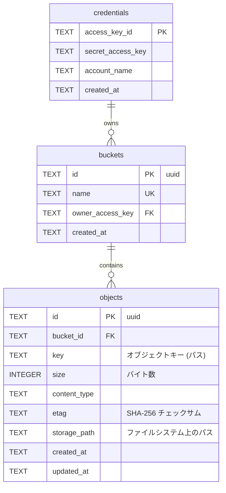

## ER 図

## テーブル定義

### credentials（認証情報）

| カラム            | 型   | 制約     | 備考                     |
| ----------------- | ---- | -------- | ------------------------ |
| access_key_id     | TEXT | PK       | AWS 形式の 20 文字英数字 |
| secret_access_key | TEXT | NOT NULL | 40 文字のシークレット    |
| account_name      | TEXT | NOT NULL | 表示用アカウント名       |
| created_at        | TEXT | NOT NULL | ISO 8601                 |

#### buckets（バケット）

| カラム           | 型   | 制約                           | 備考                                            |
| ---------------- | ---- | ------------------------------ | ----------------------------------------------- |
| id               | TEXT | PK                             | UUID v4                                         |
| name             | TEXT | UNIQUE, NOT NULL               | バケット名（3〜63文字、小文字英数字とハイフン） |
| owner_access_key | TEXT | FK → credentials.access_key_id | 所有者                                          |
| created_at       | TEXT | NOT NULL                       | ISO 8601                                        |

#### objects（オブジェクト）

| カラム       | 型      | 制約            | 備考                                                |
| ------------ | ------- | --------------- | --------------------------------------------------- |
| id           | TEXT    | PK              | UUID v4                                             |
| bucket_id    | TEXT    | FK → buckets.id | 所属バケット                                        |
| key          | TEXT    | NOT NULL        | オブジェクトキー（S3 パス）                         |
| size         | INTEGER | NOT NULL        | バイト数                                            |
| content_type | TEXT    | NOT NULL        | MIME タイプ（デフォルト: application/octet-stream） |
| etag         | TEXT    | NOT NULL        | SHA-256 ハッシュ（ダブルクォート付き）              |
| storage_path | TEXT    | NOT NULL        | ローカルファイルパス                                |
| created_at   | TEXT    | NOT NULL        | ISO 8601                                            |
| updated_at   | TEXT    | NOT NULL        | ISO 8601                                            |

**複合ユニーク制約**: (bucket_id, key) — 同一バケット内でキーの重複を禁止
